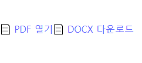
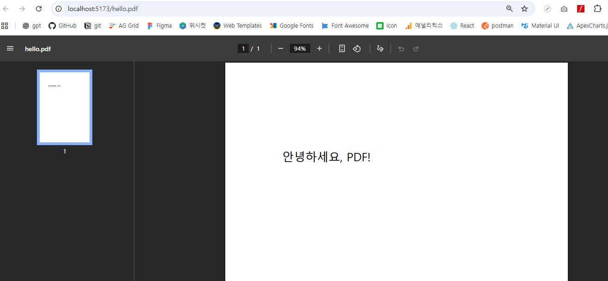
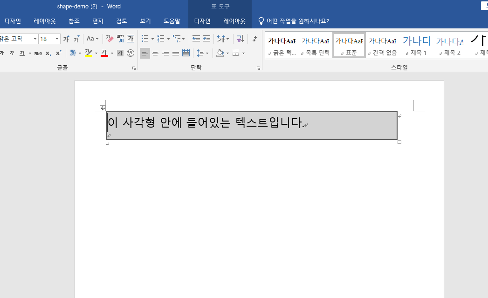

# node.js 기반의 react/vite 를 활용하여 pdf file, word file 서버로 생성

## Vite로 React 앱 생성
npm create vite@latest 생성할 파일이름

생성한 파일로 이동 후
npm i  
npm run dev

-> 브라우저로 출력된 로컬 주소 접속

## React + Vite + Node.js 서버에서 PDF/Word 생성

- 서버(Express) 설치 & 실행
  - 서버 초기화    
    npm init -y  
    (목적: server 폴더에 package.json 파일 생성 (기본값 자동 입력).)

  - 서버 의존성 설치  
    npm i pdfkit   (pdf설치)
    npm i docx     (dock설치)
    npm i -D nodemon  
    ```
    express: Node.js 서버

    pdfkit: PDF 파일 생성

    docx: Word(.docx) 파일 생성

    nodemon: 개발 시 파일이 변경될 때 서버 자동 재시작
    ```
    package.json에 "type": "module"을 추가  

  - 실행
    node 상위디렉토리/파일명.js

## 서버 실행  
npm run dev  




**서버 버튼생성으로 서버 내 pdf 생성 및 word파일 다운로드**
